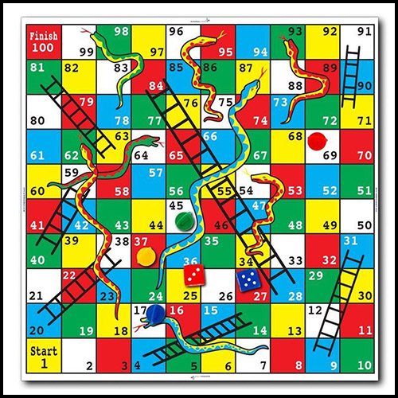
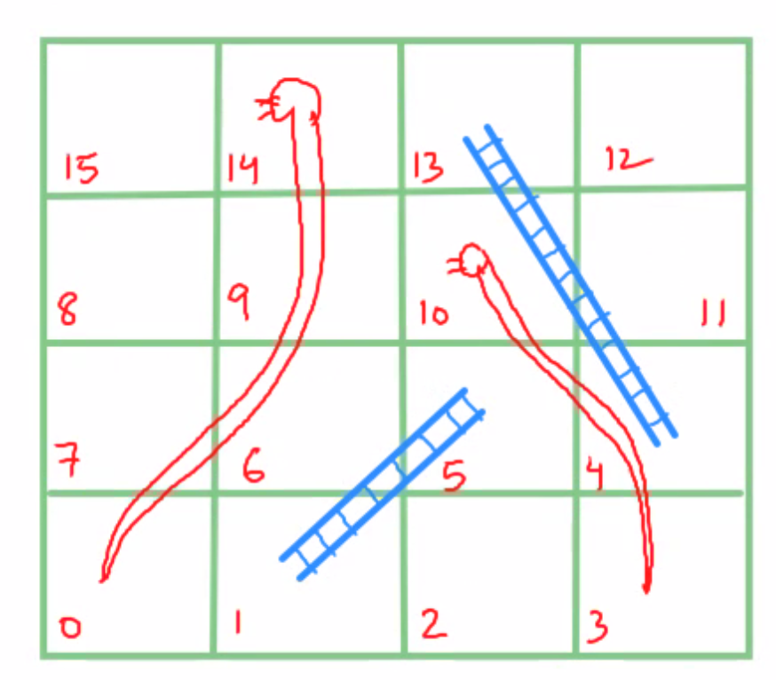

## Quantum Snakes and Ladders

The classical snakes and ladders is a board game for two or more players orginated in ancient India. It is played on a game board with numbered, gridded squares. A number of "ladders" and "snakes" are pictured on the board, each connecting two specific board squares. The object of the game is to navigate one's game piece, according to die rolls, from the start (bottom square) to the finish (top square), helped by climbing ladders but hindered by falling down snakes.

In this project, what we intended to create is a quantum version of the game, where each square is represented by a basis state of $N$ qubits. For example, with $N = 6$ qubits, we would have a board with $2^6 = 64$ squares. The ladders in the quantum game serves the role of introducing superposition of states, e.g., if there is a ladder connecting the 4th and 13th squares (as in the picture above), then if a player lands on the 4th square, his/her state becomes $\frac{1}{\sqrt 2}(\ket{13}+\ket{4})$. Now if the next dice roll is 1, which means that the player would land on the head of a snake, then the state would become $\frac{1}{\sqrt 2}(\ket{0}+\ket{4})$ because the snake connects the 14th and 0th squares. As the game progresses, while a player playing the classical game can only be in one square at any given time, a quantum computer playing the quantum game might be in multiple positions at the same time due to superposition. So at some fixed number of rounds, we expect that the quantum computer would gain an advantage over the classical player and hence achieve a higher score on average. To obtain the score of the quantum computer, we can keep track of the "trajectory", i.e. dice rolls at each step, run the quantum circuit multiple times with the same trajectory and perform measurements on the final state. The statistics will tell us what the state with the highest score is. Alternatively, there may also be way to use a Grover-like algorithm to amplify the amplitude of the state with highest score. 

For our implementation, we used 4 qubits to make 16 squares (see the second picture above). In this board, there are two ladders connecting the pairs (1, 5) and (4, 13), and two snakes for (10, 3) and (14, 0). Instead of a dice roll, we use a coin toss to decide the movement. The player moves one step forward if it's a head and two steps forward if it's a tail. In addition to the `adder` function to implement the movement, we have created the `ladder` and `snake` oracle, both requiring one ancillary qubit to control their behavior. 
